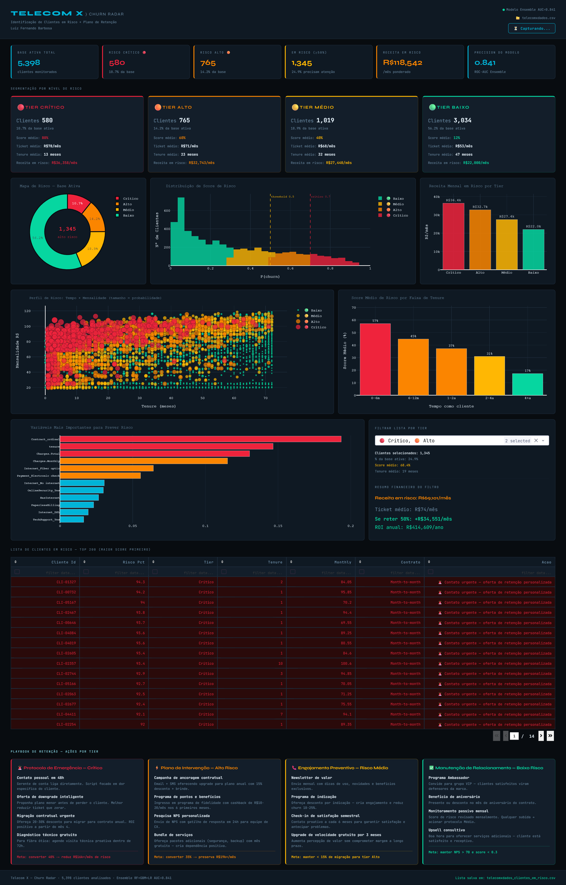

<div align="center">


<br/>

# 📡 Telecom X — Churn Radar

### Previsão de Evasão de Clientes com Machine Learning

[](https://python.org)
[](https://scikit-learn.org)
[](https://dash.plotly.com)
[](https://plotly.com)
[](LICENSE)

**Luiz Fernando Barbosa** · Challenge Telecom X — Parte 2

[📋 Sobre](#sobre) · [⚙️ Instalação](#instalação) · [🚀 Como Executar](#como-executar) · [🧠 O Modelo](#o-modelo) · [📊 Dashboard](#dashboard) · [📁 Estrutura](#estrutura-do-projeto)

</div>

---

## Sobre

> **"Sabemos quem saiu. Agora vamos descobrir quem vai sair — antes que aconteça."**

O **Churn Radar** é um sistema completo de previsão de evasão de clientes para a Telecom X. A partir de dados históricos, o sistema aprende o padrão dos clientes que cancelaram o serviço e aplica esse conhecimento sobre os **5.398 clientes ativos**, classificando cada um em um nível de risco e recomendando ações de retenção personalizadas.

### O Problema

A Telecom X apresentava uma taxa de churn de **25,7%** — com **R$ 139.131/mês** em receita em risco. Clientes que cancelavam pagavam em média **21% a mais** do que os clientes ativos, e a maior concentração de evasão ocorria nos primeiros **12 meses** de relacionamento.

### A Solução

Um pipeline de Machine Learning end-to-end com dashboard interativo que:

- 🔍 **Identifica** os clientes com maior probabilidade de cancelar
- 🎯 **Classifica** cada cliente em 4 níveis de risco (Crítico / Alto / Médio / Baixo)
- 💰 **Quantifica** a receita em risco por segmento
- 📋 **Sugere** ações de retenção específicas para cada nível
- 📸 **Exporta** o dashboard completo como imagem PNG com um clique

---

## Dashboard



> Dashboard interativo rodando em `http://localhost:8050` — com mapas de risco, histograma de scores, scatter profile, tabela filtrável de clientes e playbook de retenção completo.

---

## O Modelo

O sistema utiliza um **Ensemble Ponderado** de três algoritmos para maximizar a capacidade preditiva:

```
P(churn) = 0.45 × Random Forest
         + 0.35 × Gradient Boosting
         + 0.20 × Regressão Logística
```

| Algoritmo | Configuração | Peso |
|-----------|-------------|------|
| Random Forest | 300 árvores · max_depth=12 · class_weight=balanced | 45% |
| Gradient Boosting | 200 estimadores · lr=0.05 · subsample=0.8 | 35% |
| Regressão Logística | L2 regularização · max_iter=1000 | 20% |

### Desempenho

| Métrica | Valor |
|---------|-------|
| ROC-AUC (Ensemble) | **0.841** |
| Acurácia | 0.763 |
| Recall (churn) | **0.804** — captura 80% dos churns futuros |
| F1-Score | 0.772 |

### Resultados na Base Ativa (5.398 clientes)

| Tier | Clientes | % da Base | Score Médio | Receita em Risco |
|------|----------|-----------|-------------|-----------------|
| 🔴 Crítico | **580** | 10,7% | 79,7% | R$ 36.358/mês |
| 🟠 Alto | **765** | 14,2% | 59,9% | R$ 32.744/mês |
| 🟡 Médio | **1.019** | 18,9% | 39,8% | R$ 27.441/mês |
| 🟢 Baixo | **3.034** | 56,2% | 11,9% | R$ 22.000/mês |

> 💡 **Insight crítico:** 100% dos clientes Críticos possuem contrato **mensal** e tenure médio de apenas **13 meses** — a alavanca de retenção é clara e imediata.

---

## Instalação

### Pré-requisitos

- Python **3.10 ou superior**
- pip

### 1. Clone o repositório

```bash
git clone https://github.com/seu-usuario/telecom-x-churn-radar.git
cd telecom-x-churn-radar
```

### 2. Crie e ative o ambiente virtual

```bash
# Windows
python -m venv .venv
.venv\Scripts\activate

# Linux / macOS
python -m venv .venv
source .venv/bin/activate
```

### 3. Instale as dependências

```bash
pip install -r requirements.txt
```

Ou instale manualmente:

```bash
pip install dash dash-bootstrap-components plotly pandas scikit-learn numpy
```

---

## Como Executar

### Execução padrão

```bash
python telecom_churn_radar.py dados/dadosTratados.csv
```

> O arquivo `dados/dadosTratados.csv` deve estar na pasta `dados/` na raiz do projeto.

### Especificando outro arquivo de dados

```bash
python telecom_churn_radar.py dados/meus_dados.csv
```

### Acessar o dashboard

Após a execução, abra no navegador:

```
http://localhost:8050
```

### O que acontece ao rodar

```
════════════════════════════════════════════════════════════════
  🎯 TELECOM X — CHURN RADAR
════════════════════════════════════════════════════════════════

📂 [1/6] Carregando dados...
⚙  [2/6] Preparando features para modelagem...
🤖 [3/6] Treinando modelo ensemble no histórico completo...
🔮 [4/6] Aplicando modelo nos 5.398 clientes ativos...
📊 [5/6] Segmentando clientes por nível de risco...
💾 [6/6] Salvando lista de clientes em risco...

🌐 Dashboard: http://localhost:8050
```

---

## Recursos do Dashboard

### 📊 Visualizações

| Painel | Descrição |
|--------|-----------|
| **KPIs** | Base ativa, críticos, alto risco, receita em risco e AUC do modelo |
| **Tier Cards** | Score médio, ticket, tenure e receita em risco por nível |
| **Mapa de Risco (Donut)** | Distribuição percentual dos 4 tiers |
| **Histograma de Scores** | Distribuição da probabilidade P(churn) por tier |
| **Scatter Tenure × Mensalidade** | Perfil visual de risco (tamanho = probabilidade) |
| **Score por Faixa de Tenure** | Risco médio por tempo de relacionamento |
| **Importância de Variáveis** | Top 12 features do Random Forest |
| **Tabela de Clientes** | Lista filtrável dos 200 maiores scores com ação recomendada |
| **Playbook de Retenção** | Ações específicas por tier com ROI estimado |

### 🎛️ Interatividade

- **Filtro por Tier** — selecione combinações de tiers e veja receita em risco + ROI em tempo real
- **Tabela filtrável e ordenável** — busque e ordene clientes por qualquer coluna
- **📸 Capturar Dashboard** — botão no header que exporta todo o dashboard como PNG de alta resolução

---

## Estrutura do Projeto

```
telecom-x-churn-radar/
│
├── telecom_churn_radar.py      # Script principal — pipeline + dashboard
├── requirements.txt            # Dependências do projeto
├── README.md                   # Este arquivo
│
├── dados/                      # Dados de entrada
│   └── dadosTratados.csv       # Dataset principal (não incluído no repo)
│
├── imagens/                    # Imagens do projeto
│   ├── desafioTelecomX.png     # Banner do repositório
│   └── infografico.png         # Screenshot do dashboard
│
└── outputs/                    # Gerados automaticamente
    ├── clientes_em_risco.csv   # Lista completa com scores e tiers
    └── *.png                   # Screenshots exportados pelo botão
```

---

## Pipeline Técnico

```
Dados Brutos (7.267 clientes)
        │
        ▼
[1] Limpeza e Tipagem
    └── bool→int, Charges.Total numérico, NaN→mediana
        │
        ▼
[2] Feature Engineering
    └── Remoção de 9 colunas irrelevantes/duplicatas
    └── One-hot encoding de variáveis categóricas
        │
        ▼
[3] Balanceamento
    └── Undersampling da classe majoritária (5.398→1.869)
    └── Dataset balanceado: 3.738 registros (50/50)
        │
        ▼
[4] Treinamento (split 70/30 estratificado)
    └── Random Forest  (45%)
    └── Gradient Boosting (35%)
    └── Regressão Logística (20%)
        │
        ▼
[5] Predição nos 5.398 clientes ATIVOS
    └── Score de risco: P(churn) ∈ [0, 1]
    └── Segmentação em 4 tiers
        │
        ▼
[6] Dashboard + Playbook de Retenção
```

---

## Top Variáveis Preditivas

As 5 variáveis mais importantes para prever o churn, segundo o Random Forest:

| # | Variável | Importância | Interpretação |
|---|----------|-------------|---------------|
| 1 | `Contract_ordinal` | 0.1598 | Tipo de contrato — maior protetor estrutural |
| 2 | `tenure` | 0.1446 | Tempo de relacionamento — novos clientes são voláteis |
| 3 | `Charges.Total` | 0.1445 | Valor total gasto — maior spend = maior comprometimento |
| 4 | `Charges.Monthly` | 0.0891 | Mensalidade alta gera sensibilidade a preço |
| 5 | `Internet_Fiber optic` | 0.0743 | Altas expectativas, fácil frustração |

---

## Tecnologias Utilizadas

<div align="center">

| Categoria | Tecnologia | Uso |
|-----------|-----------|-----|
| Linguagem |  | Core do sistema |
| ML |  | RandomForest, GBM, LogReg, métricas |
| Dashboard |  | Framework web interativo |
| Visualização |  | Gráficos interativos |
| Data |  | Manipulação e análise de dados |
| Numérico |  | Operações matriciais e predição |
| UI |  | Componentes visuais do dashboard |
| Screenshot | html2canvas | Exportação do dashboard como PNG |

</div>

---

## Estratégia de Retenção

Com base nos resultados do modelo, o playbook recomendado para evitar novos churns:

**🔴 Crítico (580 clientes)** — Contato pessoal em 48h + oferta de migração para contrato anual com 20-30% de desconto. Meta: reter 40% → preserva **R$ 14.5k/mês**.

**🟠 Alto (765 clientes)** — Campanha de ancoragem contratual + bundle de serviços com mês grátis. Meta: reter 35% → preserva **R$ 11.5k/mês**.

**🟡 Médio (1.019 clientes)** — Newsletter de valor + programa de indicação + check-in semestral. Meta: manter menos de 15% migrando para o tier Alto.

**🟢 Baixo (3.034 clientes)** — Programa Ambassador + benefício de aniversário + monitoramento passivo mensal.

> 💰 **ROI total estimado:** Se as metas de Crítico e Alto forem atingidas → **R$ 26k+/mês** preservados · **R$ 312k+/ano**

---

## Autor

<div align="center">

**Luiz Fernando Barbosa**

Challenge Telecom X — Parte 2 · Projeto de Ciência de Dados

[](https://github.com/seu-usuario)
[](https://linkedin.com/in/seu-perfil)

</div>

---

<div align="center">

*Telecom X · Churn Radar · 5.398 clientes analisados · Ensemble RF+GBM+LR · AUC=0.841*

</div>
